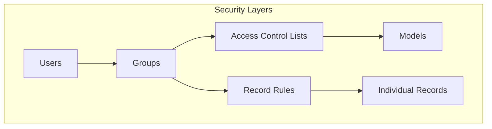

# Security

Access control and security definitions in impersonate_login.

## Access Control Lists (ACLs)

Model access permissions defined in:
- **[ir.model.access.csv](../impersonate_login/security/ir.model.access.csv)**
  - 1 model access rules

## Record Rules

Row-level security rules defined in:

## Security Groups & Configuration

Security groups and permissions defined in:
- **[group.xml](../impersonate_login/security/group.xml)**
  - 1 security groups defined

Security files overview:
- **[group.xml](../impersonate_login/security/group.xml)**
  - Security groups, categories, and XML-based rules
- **[ir.model.access.csv](../impersonate_login/security/ir.model.access.csv)**
  - Model access permissions (CRUD rights)

Notes
- Access Control Lists define which groups can access which models
- Record Rules provide row-level security (filter records by user/group)
- Security groups organize users and define permission sets
- All security is enforced at the ORM level by Odoo
